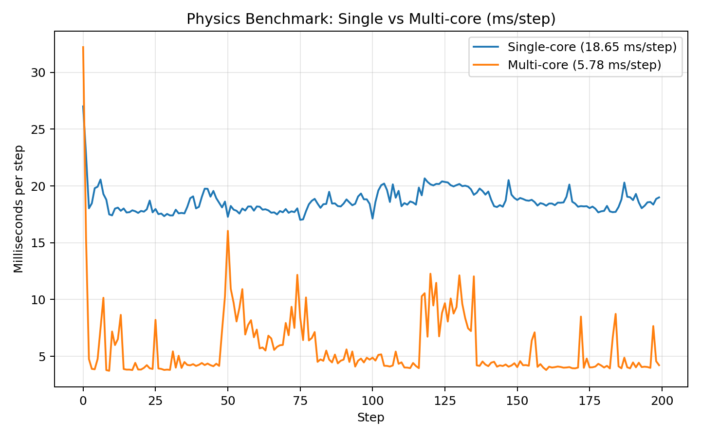
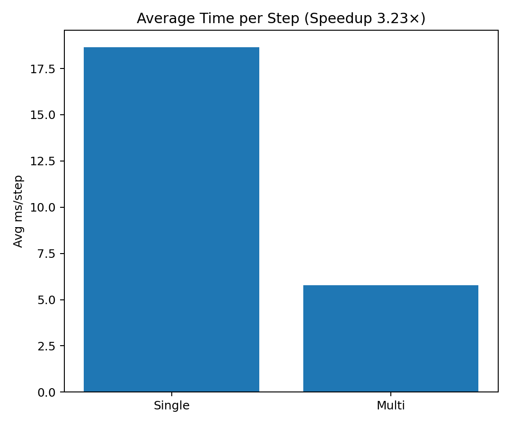

# Parallel 2D Physics Engine (C, OpenMP, AVX2)
### *C | OpenMP | AVX2 | Profiling with gprof*

A lightweight 2D physics simulation engine in pure C. It demonstrates CPU parallelism with OpenMP, SIMD (AVX2 + FMA) for hot vector math, and profiling-driven optimisation using `gprof`. Benchmarks emit CSV; a Python script generates plots.

It’s designed as a compact showcase of high-performance physics architecture for **game development**, **simulation**, and **parallel computing** research.

---

## Key Features
- **SIMD Acceleration** — AVX2/FMA batch kernel in the narrow phase, verified against a scalar reference (`--verify`)  
- **Spatial Partitioning Grid** for efficient collision culling (O(n) average)  
- **Thread-Safe Contact Resolution** via per-thread accumulators and stable velocity/position integration  
- **Profiling Support** with `MODE=profile` — note gprof only samples the master thread, so use `perf` for anything threaded  
- **CSV Output + Python Analytics** for benchmarking and performance visualization  

---

## Correctness

The batched SIMD detector is checked against a plain single-threaded scalar
implementation over the same grid:

```bash
./physics_bench -n 40000 -box 900 -cell 24 --verify
```

It compares the contact *set* exactly and the penetration/normal *values* to a
tolerance. Not bit-exact by design: the vector path computes the squared
distance with FMA, which does not round the intermediate product, so results can
land an ulp from the scalar path. Knowing which of those two you need is the
whole point of writing the check.

CI runs this on x86 with AVX2 on and off, on arm64 (where the scalar fallback is
what builds), and under AddressSanitizer and ThreadSanitizer.

## Known limitations

Written down rather than left to be discovered:

- **Scaling is about 3x on 32 threads, and the solver is why.** The Jacobi
  reduction allocates `threads x 2` dense arrays of `n` floats every step and
  sums across them. At n=120k, T=32 that is ~30 MB zeroed and read back per
  step that does not exist at one thread, and the reduction touches T distinct
  cache lines per body. It is an O(n·T) term, partly serial. The fix is not a
  faster reduction — it is not having one: graph-colour the contacts so each
  colour touches disjoint bodies and accumulate straight into the velocities.
- **The reported ms/step is not the whole step.** Timing starts after the grid
  is built and stops before the energy and penetration scans, all of which are
  serial. End-to-end speedup is worse than the figure below.
- **Wall reflection flips velocity unconditionally**, without checking the body
  is actually heading into the wall. That injects energy.
- One Jacobi iteration, so stacks do not resolve; the Baumgarte bias carries it.

## Build & Run (Linux / WSL)
```bash

# Clone repository
git clone https://github.com/1sitm3n/Parallel-2D-Physics-Engine-C.git
cd Parallel-2D-Physics-Engine-C

# Build in release mode with OpenMP + AVX2
make OMP=1 AVX2=1 MODE=release

# Multi-core benchmark
OMP_NUM_THREADS=$(nproc) ./physics_bench -n 120000 -steps 200 -dt 0.008 -box 1500 -csv bench_multi.csv

# Single-core benchmark
OMP_NUM_THREADS=1 ./physics_bench -n 120000 -steps 200 -dt 0.008 -box 1500 -csv bench_single.csv

# Generate analysis & plots
python3 analyze_bench.py

---

Example output:
| Mode         | Threads | Avg ms/step | Speedup vs Single |
|---------------|---------|-------------|-------------------|
| Single-core   | 1       | 17.47       | 1.00x             |
| Multi-core    | 32      | 5.86        | 2.98x             |

---

Performance Comparison

Single vs Multi-Core Step Time


Overall Speedup


---
Profiling Example

To profile performance hotspots using gprof:

make clean && make OMP=1 AVX2=1 MODE=profile
OMP_NUM_THREADS=$(nproc) ./physics_bench -n 100000 -steps 120 -dt 0.008 -box 1500
gprof ./physics_bench gmon.out | less

---

Example output excerpt:

Flat profile:

Each sample counts as 0.01 seconds.
  %   cumulative   self              self     total
 time   seconds   seconds    calls  ms/call  ms/call  name
 96.7      0.59     0.59      120     4.92     4.92  grid_free
  1.6      0.60     0.01      120     0.08     0.08  grid_build

---
Project Structure
physics2d/
├── main.c               # Entry point & benchmarking loop
├── world.c/h            # Physics state, integration, energy
├── collide.c/h          # Collision detection & resolution
├── grid.c/h             # Spatial partitioning system
├── simd.c/h             # AVX2-optimised vector math
├── timing.c/h           # High-precision timers
├── csv.c/h              # Benchmark logging (CSV)
├── analyze_bench.py     # Python plotting script
├── Makefile             # Build configuration (OMP/AVX2/Profile modes)
└── restore.sh           # Full environment restore script

---

Build Modes

| Mode           | Description                                   |
| -------------- | --------------------------------------------- |
| `MODE=release` | Optimised build with O3, fast-math, AVX2      |
| `MODE=debug`   | No optimisation, full symbols                 |
| `MODE=profile` | Includes `-pg` for gprof performance analysis |

---

Example Results (Intel i7-13700HX, 32 threads)

| Threads | Bodies | Steps | Avg ms/step | Speedup |
| ------- | ------ | ----- | ----------- | ------- |
| 1       | 120000 | 200   | 17.47       | 1.00x   |
| 32      | 120000 | 200   | 5.86        | 2.98x   |

---

### Dependencies

GCC 11+ with OpenMP support
Python 3.8+ with pandas and matplotlib
Linux or Windows Subsystem for Linux (WSL2)

Install Python dependencies:
pip install --break-system-packages pandas matplotlib

---
License

This project is released under the MIT License — free for academic, research, and commercial use.
Feel free to fork, improve, and reference for your own parallel simulation projects.

---

Author

Mehmet Işitmen (1sitm3n)
Parallel Systems Engineer · AI & Game Developer
memetisitmen@outlook.com
github.com/1sitm3n

